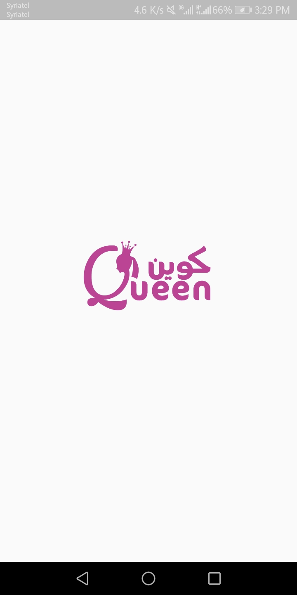

# 👑 Queen Care - Client Application (Alpha Step)

**Queen Care** is an e-commerce Flutter application that enables customers to browse and order Queen Care's beauty and personal care products with ease. This version is the **Alpha** step of development, focusing on core shopping and user account features.

---
✨ Features
🛍️ Product Catalog

Browse Queen Care products with images, details, and pricing.

Organized by category for easy navigation.

🧾 Order Management

Add items to a shopping cart and place orders.

Review order history and order statuses.

🔐 User Authentication

Register and log in securely.

Manage user profile and preferences.

🎁 Offers & Contests (العروض والمسابقات)

View current offers and promotions.

Participate in public contests (المسابقات العامة).

Claim personal rewards (جوائزي).

⭐ Points System (نقاطي)

Earn loyalty points through purchases or participation.

Redeem points for future rewards and discounts.

📷 QR Code Scanner (مسح QR)

Quickly scan QR codes from products or promotions.

Instant access to product info or contest participation.

📣 Consultation System (استشارة)

View frequently asked questions (الأسئلة المتكررة).

Submit private consultations and get tailored advice.

🌐 Backend API Integration

Connects to REST APIs for products, orders, and user data.

📱 Responsive UI/UX

Clean and modern design.

Fully responsive across mobile screen sizes.

## 📸 App Screenshots

